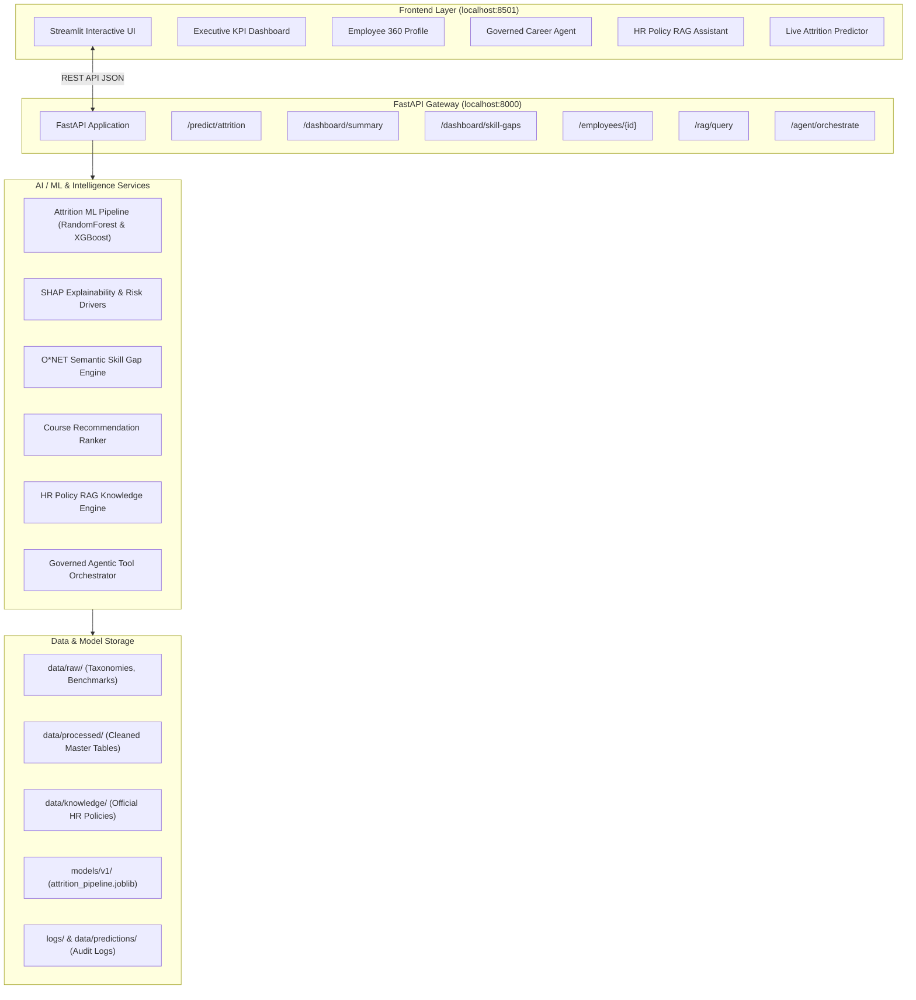

Deployment Link - https://enterprise-hr-ai-model.streamlit.app/

# Enterprise HR AI — Workforce Intelligence & Upskilling Platform

An end-to-end, locally runnable enterprise HR decision-support system that predicts attrition risk, maps organizational skills, computes competency gaps, personalizes upskilling courses, answers policy inquiries via grounded RAG, and orchestrates workforce workflows via governed AI agents.

---

## 1. Project Overview & Problem Statement
Modern enterprises maintain fragmented employee datasets across disconnected HRMS, payroll, performance, and learning systems. Consequently, workforce planning is often reactive rather than predictive:
- **Attrition Risk:** Companies struggle to identify early turnover indicators before valuable talent leaves.
- **Skill Gaps:** Lack of visibility into organization-wide competency shortages across technical domains.
- **Generic Training:** One-size-fits-all training recommendations that ignore individual gaps and career paths.
- **Scattered Policy Knowledge:** HR policy handbooks and benefits guidelines are difficult to navigate for employees.

**Enterprise HR AI** solves these challenges in a unified, grounded, and ethical platform.

---

## 2. Platform Architecture



---

## 3. Dataset Ecosystem & Taxonomies

1. **`data/raw/employee_attrition.csv`** (1,470 records, 35 columns): IBM HR employee attrition benchmark dataset with compensation, job satisfaction, tenure, and turnover status.
2. **`data/raw/hr_performance_engagement.csv`** (5,000 records, 13 columns): Operational performance dataset with attendance, KPI score, peer evaluation, and manager ratings.
3. **`data/raw/occupation_data.csv`** (1,016 records): O*NET Standard Occupational Classification (SOC) master taxonomy.
4. **`data/raw/essential_skills.csv`** (18,200 records): O*NET foundational skill importance and level ratings across 910 occupations.
5. **`data/raw/software_skills.csv`** (31,821 records): O*NET technical tools, software, and technology competencies.
6. **`data/knowledge/`** (6 Corporate HR Policies): Ground-truth policy markdown documents covering Parental Leave, Remote Work, Performance Evaluation, Tuition Reimbursement, Medical Benefits, and Code of Conduct.

---

## 4. Machine Learning & Explainability

### Models Compared:
* **Logistic Regression:** Explainable linear baseline ($ROC-AUC: 0.76$).
* **XGBoost Classifier:** Gradient-boosted decision tree ($ROC-AUC: 0.77$).
* **Random Forest Classifier (Winning Model):** Balanced ensemble handling non-linear tenure interactions ($ROC-AUC: 0.7853$, $PR-AUC: 0.4612$).

### Predictive Governance & Ethical AI:
* Constant zero-variance columns (`EmployeeCount`, `Over18`, `StandardHours`) dropped.
* Sensitive demographic features (`gender`, `marital_status`) **strictly excluded** from predictive feature sets.
* Target leakage strictly avoided.

### SHAP Explainability:
* **Global Drivers:** Frequent overtime, low job satisfaction, low environment satisfaction, promotion stagnation, and zero stock options.
* **Local Per-Employee Explanations:** Explains exact top contributing factors for every prediction.

---

## 5. Skills Intelligence & Recommendation Engine

* **O*NET Taxonomy Alignment:** Maps internal job roles to official O*NET SOC occupations.
* **Skill Gap Equation:**
  $$\text{Skill Gap} = \text{Required Skills}(\text{Target Role}) \setminus \text{Current Employee Skills}$$
* **Career Readiness Score:**
  $$\text{Readiness \%} = \left( 1 - \frac{\text{Missing Skills}}{\text{Total Required Skills}} \right) \times 100$$
* **Course Catalog:** Structured catalog across Data Science, AI/ML, Cloud Architecture, DevOps, Security, and Leadership.

---

## 6. Grounded RAG & Governed Agentic AI

### HR Policy RAG:
* **Zero-Hallucination Retrieval:** Chunks official policy documents and retrieves top matching sections with relevance scores and file citations.

### Governed Agent Workflow:
* Multi-step autonomous tool execution with security boundary outside the LLM:
  1. `get_employee_profile(employee_id)`
  2. `get_role_requirements(target_role)`
  3. `calculate_skill_gap(current_skills, required_skills)`
  4. `recommend_courses(missing_skills)`
  5. `generate_learning_plan()`

---

## 7. API Endpoints Reference

| Method | Endpoint | Description |
|---|---|---|
| `GET` | `/` | API health check & version info |
| `POST` | `/predict/attrition` | Live prediction of attrition probability & risk factors |
| `GET` | `/dashboard/summary` | Overall KPI metrics (Workforce count, High risk count, Avg engagement) |
| `GET` | `/dashboard/attrition-by-department` | Department-level attrition risk breakdown |
| `GET` | `/dashboard/engagement-by-department` | Department engagement & KPI metrics |
| `GET` | `/dashboard/skill-gaps` | Critical organization-wide skill gap frequency & severity |
| `GET` | `/dashboard/recommendations` | Upskilling recommendations list |
| `GET` | `/courses` | Master corporate course catalog |
| `GET` | `/employees` | List employee directory |
| `GET` | `/employees/{employee_id}` | Detailed 360° employee intelligence profile |
| `POST` | `/rag/query` | Grounded HR policy retrieval & answering |
| `POST` | `/agent/orchestrate` | Governed multi-tool career upskilling agent |

---

## 8. How to Install & Run Locally

### Prerequisites
* Python 3.10, 3.11, or 3.12 installed on local machine.

### Installation
```bash
# 1. Clone or navigate to the workspace
cd "enterprise hr ai"

# 2. Install dependencies
pip install -r requirements.txt
```

### Running the Application (Localhost)

#### Step 1: Start FastAPI Backend (Port 8000)
```bash
uvicorn app.main:app --host 127.0.0.1 --port 8000 --reload
```
* Backend API documentation available at: `http://localhost:8000/docs`

#### Step 2: Start Streamlit Frontend (Port 8501)
In a separate terminal:
```bash
streamlit run frontend/streamlit_app.py --server.port 8501
```
* Interactive UI available at: `http://localhost:8501`

---

## 9. Running Tests
Run the comprehensive Pytest suite:
```bash
pytest -v
```
**Test Coverage:**
* Input validation & Pydantic schemas (`test_validation.py`)
* Model inference bounds & probability calibration (`test_ml_pipeline.py`)
* Skill gap subtraction & readiness arithmetic (`test_skills_engine.py`)
* End-to-end API HTTP status codes and responses (`test_api_endpoints.py`)

---

## 10. Master Notebooks Directory
The analytical foundation is preserved across 16 numbered notebooks in `notebooks/`:
* `01_data_understanding.ipynb`
* `02_data_validation.ipynb`
* `03_data_cleaning.ipynb`
* `04_data_relationships.ipynb`
* `05_feature_engineering.ipynb`
* `06_baseline_model.ipynb`
* `07_model_comparison.ipynb`
* `08_model_explainability.ipynb`
* `09_model_versioning.ipynb`
* `10_engagement_intelligence.ipynb`
* `11_role_intelligence.ipynb`
* `12_employee_skills.ipynb`
* `13_skill_gap_engine.ipynb`
* `14_organization_skill_gap.ipynb`
* `15_recommendation_engine.ipynb`
* `16_employee_intelligence.ipynb`
