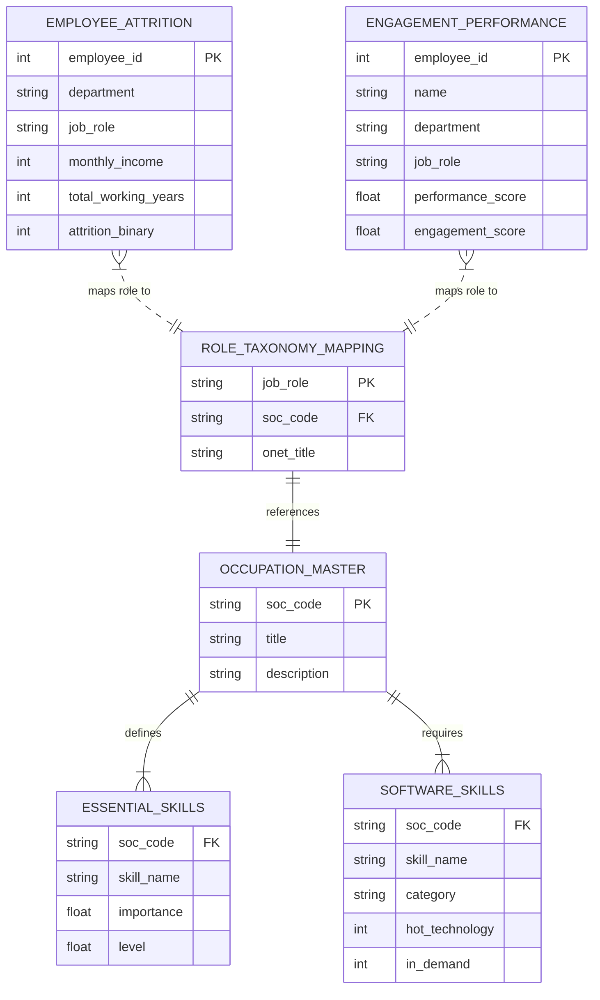

# Data Relationships & Entity Architecture

**Project:** Enterprise HR AI Platform  
**Document Version:** 1.0.0  
**Status:** Verified  

---

## 1. Verified Entity Relationship Model

---

## 2. Table-by-Table Relationship Specifications

| Source Table | Target Table | Join Key | Relationship Cardinality | Safe to Join? | Evidence / Rationale |
| :--- | :--- | :--- | :--- | :--- | :--- |
| `employee_attrition_processed` | `role_taxonomy_mapping` | `job_role` | Many-to-One | **YES** | All 9 distinct job roles map directly to verified O*NET SOC codes. |
| `engagement_processed` | `role_taxonomy_mapping` | `job_role` | Many-to-One | **YES** | All 15 distinct job roles map directly to verified O*NET SOC codes. |
| `role_taxonomy_mapping` | `occupation_master` | `soc_code` | Many-to-One | **YES** | Exact SOC code foreign key matches master taxonomy. |
| `occupation_master` | `essential_skills_processed` | `soc_code` | One-to-Many | **YES** | Defines 10 foundational skill importance & levels per occupation. |
| `occupation_master` | `software_skills_processed` | `soc_code` | One-to-Many | **YES** | Maps workplace technical tools and software to SOC occupations. |
| `employee_attrition_processed` | `engagement_processed` | `employee_id` | N/A | **NO (STRICTLY DISALLOWED)** | Disjoint ID spaces across separate datasets. Merging causes entity distortion. |

---

## 3. Skill Matching & Gap Traversal Rules

1. **Role Requirement Resolution:**
   $$\text{Role Requirements} = \text{EssentialSkills}(\text{soc\_code}) \cup \text{SoftwareSkills}(\text{soc\_code})$$
2. **Employee Gap Traversal:**
   $$\text{Skill Gap} = \text{Role Requirements}(\text{Target Role}) \setminus \text{Employee Current Skills}$$
3. **Semantic Equivalence:** Skills are matched using normalized taxonomy IDs and semantic vector cosine similarity rather than brittle exact-string matching alone.
